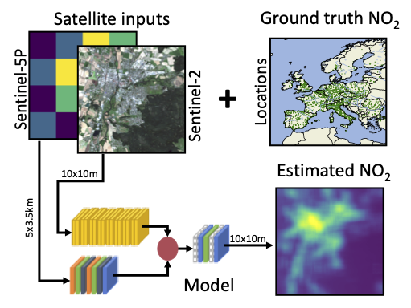

# Towards Global Estimation of Ground-Level NO2 Pollution with Deep Learning and Remote Sensing

This repository provides the code for a forthcoming paper on the estimation of surface-level NO2 concentrations from various data sources. 

## Local Model
The local model (`local_model` directory) estimates surface NO2 for locations of EEA air quality ground stations based on station metadata with XGBoost.
There are two noteboooks for finding a good hyperparameter configuration and evaluation across multiple seeds, respectively.

## OSM Model
This model (`osm_model` directory) is based on land cover statistics derived from the [OpenStreetMap](https://www.openstreetmap.org/) project and estimates NO2 with XGBoost.
There are two notebooks for finding a good hyperparameter configuration and evaluation across multiple seeds, respectively.

## Satellite Model
The satellite model (`satellite_model` directory) uses remote sensing data (Sentinel-1 and Sentinel-5P) to expand high-resolution NO2 estimation to a global scale.
The model is an artificial neural network with two input streams for the different data modalities, trained against ground-stations measurements in Europe.
The remote sensing data for training the network has to be downloaded separately from [Zenodo](https://zenodo.org).

<p align="center">
  
</p>

To train the model yourself, download data from zenodo and store it in a data directory with subdirectories called `sentinel-2` and `sentinel-5p`. These should then contain the one directory for each ground station with the corresponding files.
E.g.:

```
- eea
  - sentinel-2
     - GIB_Station_GB0050A
         - S2A_MSIL2A_20200715T110621_N0214_R137_T30STF_20200715T140105.npy
     - GIB_Station_GB0051A
         - S2A_MSIL2A_20200715T110621_N0214_R137_T30STF_20200715T140105.npy
     - ...
  - sentinel-5p
     - GIB_Station_GB0050A
         - l3_mean_europe_2018_2020_005dg.netcdf
     - GIB_Station_GB0051A
         - l3_mean_europe_2018_2020_005dg.netcdf
     - ...
```

Training can be started with with the `satellite_model/training.py` script. This script logs data to [mlflow](https://mlflow.org). Hyperparameters can be adjusted via command line arguments.

**Example:** To start training for 20 epochs with the remote sensing data located in `/home/user/eea/`, run the following  from the `satellite_model` directory.

```
python training.py --epochs=20 --datadir=/home/user/eea
```
